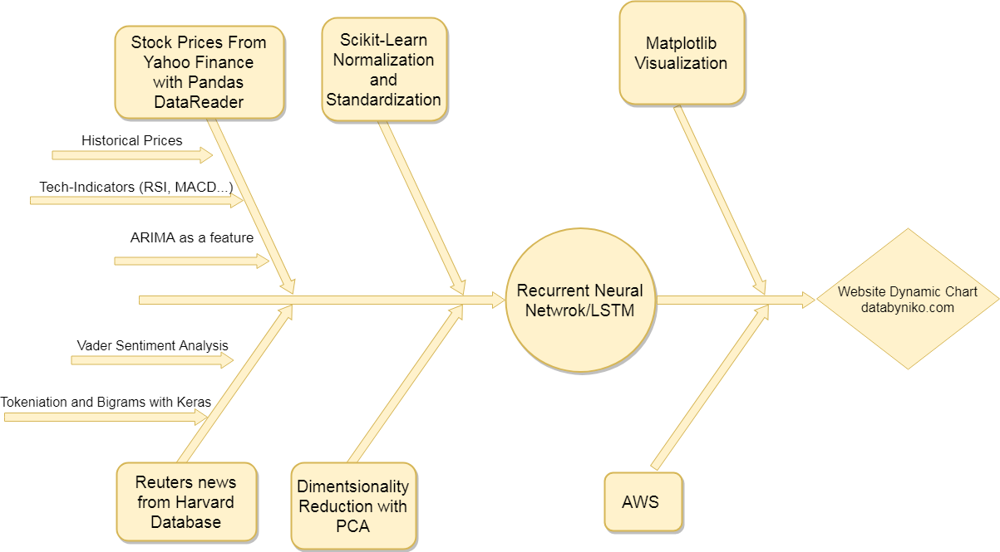
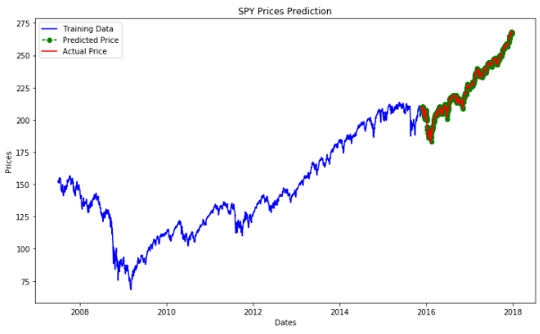
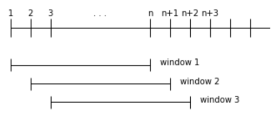
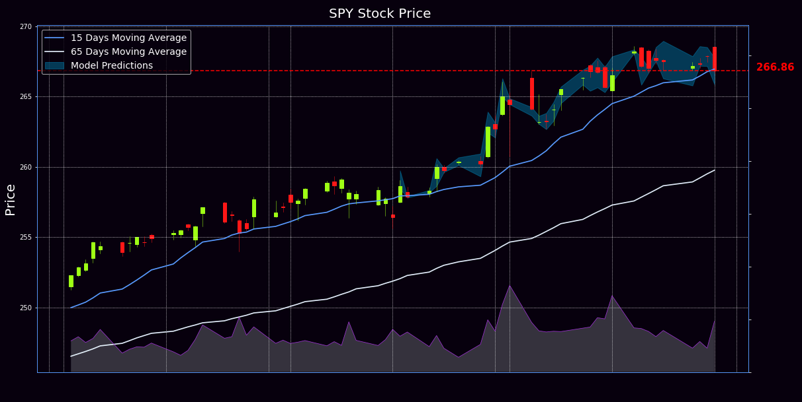

# Forecasting daily S&P500 prices

### ** Please make sure to read the disclaimer included in this repository!**

## Project Motivation

Studying how global stock market indexes respond to headlines can provide a major advantage in predicting stock movements and making trade decisions. Naturally, fundamental and technical indicators are not to be neglected and the goal of the project is to combine all of these aspects to achieve a model that thinks as an experienced trader without any emotions. 

## Process Overview

## Data Sources

### News Data 

Currently, official data sources to obtain historical financial news are limited. Most sources like NewsApi only allow access to the last few days of data for free and it would cost approximately $1000 to gather all the data necessary for this project. I was able to find a dataset from a Harvard Database providing 16 million financial headlines with timestamps from January 2007 to December 2017.

I will use news NewsApi to collect last 30 days worth of news for an additional test dataset.

### Fundamental and Technical Data – pandas_datareader

Pandas has an extremely useful library for finance. I used pip install pandas_datareader to be able to pull any stock's live data from multiple sources. For the purpose of this project I chose **Yahoo Finance** as main source by passing the yahoo argument into pandas_datareader.
Once I have obtained Open, Close, High, Low and Volume for the dates I need, all the technical indicators like RSI, MACD and Moving Averages are calculated manually with a few lines of code. 

### Correlated Assets

Correlated assets as ETFs representing the major industries part of the S&P500 are great candidates for significantly useful feature to predict the target. They are unfortunately likely to generate multicollinearity between the features but that will be fixed while performing dimensionality reduction through PCA. In addition to data from the targeted SPY ETF, I have selected the following ten tickers to extract features from:

* **XLF** for Financials
* **EEM** for Emerging Markets
* **XRT** for S&P Retail
* **FXI** for China Large Cap
* **XHB** for S&P Homebuilders (Tracks real estate)
* **TLT** for20 yr Treasury Bond
* **USO** for US Oil Fund
* **DBC** for Commodity Tracking
* **GLD** for Gold
* **QQQ** for Nasdaq 100

## NLP Model Selection

After experimentation with the BoW model and word embedding, I chose to use Vader Sentiment Analysis to keep a reasonable number of features and also because the quality of the news data was not allowing to get significant result. 

## ARIMA as a Feature

Using a simple Scikit Learn ARIMA model provides, a good prediction of next day stock price. It won’t be enough to turn a profit as a trader because it is missing crucial news information but I am going to use it as a feature 

## Scaling and Dimensionality reduction through PCA

After scaling  and standardizing the data the Principal Component Analysis is a key transformation in our process due to the correlation between many of the features. Principal component analysis, or PCA, is a statistical procedure that allows you to summarize the information content in large data tables by means of a smaller set of “summary indices” that can be more easily visualized and analyzed. The resulting dataset is likely to have a significantly smaller number of features thus speeding up modelling by using less computational resources and also eliminating multicollinearity. 

## Using a rolling window

The idea is to predict X(t+1), next value in a time series, we feed not only X(t), but X(t-1), X(t-2) etc to the model. We will be feeding our Recurrent Neural Network with the previous week of feature values at every step.  I tried this with multiple values as sixty days or twenty days but it seems that seven days which is a little longer than a trading week provides the best results

## Recurrent Neural Network for Predictions

At a high level, a Recurrent Neural Network (RNN) processes sequences — like daily stock prices — one element at a time while retaining a state of what has come previously in the sequence. LSTM cells in a RNN are meant to allow past information to be reinjected at a later time and this is the reason I picked this model for predicting stock movements. 

## Showing Results and Predictions in a Matplotlib based Technical Analysis Chart

The following chart is a sample of what we expect the final result to look like:

## AWS

Once a satisfying model is obtained, the goal of the project is to upload the h5 model file along with pickled tokenizers, scalers, PCA transformers and data generation script on an EC2 instance on AWS. The EC2 instance is going to be updating a chart in a S3 bucket every second during market hours showing current live price movement and model prediction. The chart is meant to be sontantly updated live on databyniko.com by a JavaScript.
